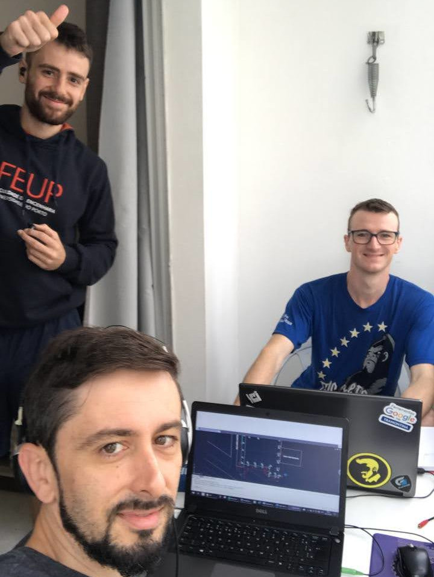

# William Pilger | Authenty

### Fala, tchê! 👋

Sou William, desenvolvedor de softwares, e Sócio-Administrador na Authenty Ltda. Trabalho criando ferramentas que ajudam engenheiros/arquitetos e empresas a organizarem melhor seus processos, e aumentarem a produtividade em seus projetos.

---

## Sobre mim

Atuo no desenvolvimento de softwares voltados à engenharia, principalmente para dimensionamento, automação de tarefas e apoio à tomada de decisão técnica. No dia a dia, estou envolvido com:

- desenho e implementação de novas funcionalidades;
- melhoria desempenho de código;
- organização e padronização de ambientes de desenvolvimento;
- integrações entre sistemas internos e de terceiros (gateways de pagamento, etc.);
- manutenção e evolução de sistemas de licenciamento e controle de acesso;
- infraestrutura em nuvem com Google Cloud Platform (GCP).

Experiência com:

- Sistemas Operacionais: Linux (Debian, Ubuntu) e Windows;
- DevOps: Docker, GCP (Cloud Run, Cloud Storage, Cloud SQL, App Engine);
- Linguagens de programação: TypeScript/JavaScript (Node.js), Bash, PHP, C#, Python;
- Bancos de dados: MySQL/MariaDB;
- Frameworks e bibliotecas: React;
- Controle de versão: Git (GitHub, GitLab);
- Metodologias ágeis: Scrum.

---

## Atuação profissional

- (2021 - hoje) **COO e Desenvolvedor de Softwares para Engenharia na Authenty.**  
  Atuação na gestão operacional e no desenvolvimento de produtos digitais para engenharia, com foco em qualidade técnica, usabilidade e aderência às normas e boas práticas.

- (2023 - hoje) **Sócio-administrador da MDA Tecnologia da Informação LTDA (Authenty)**  
  Participação na estratégia da empresa, definição de produtos, melhoria de processos internos e apoio na integração entre área técnica, comercial e atendimento.

- (2018 - 2021) **Eletricista Projetista/Desenhista na Tramontina S.A. Cutelaria**  
  Desenvolvimento de projetos elétricos industriais (adequação de máquinas à NR-12), controle de estoque e compra técnica de materiais elétricos.

---

## Áreas de interesse

- Desenvolvimento de ferramentas para engenharia (cálculo, apoio a projeto, relatórios)
- Automação de tarefas e padronização de ambientes (Linux e Windows)
- Organização de código, documentação e boas práticas de versionamento
- Infraestrutura em nuvem (GCP, Docker)
- Tecnologias web (React, Node.js, TypeScript)
- Educação e compartilhamento de conhecimento técnico

---

## Destaques aqui no GitHub

- **Pessoal / Personalização**
  - [PostInstall Scripts - Linux Distributions](PostInstallScripts_LinuxShell)  
  - [PostInstall Scripts - Windows (Beta)](PostInstallScripts_Windows)

Outros repositórios incluem ferramentas para produtividade, automação, utilitários gerais e experimentos em diferentes linguagens e tecnologias.

---

## Estatísticas GitHub

  

---

## Onde me encontrar

<a href="https://www.linkedin.com/in/william-pilger-3a076ba6" target="_blank" style="text-decoration: none; color: inherit;">
  
  William Pilger
</a>
&nbsp;&nbsp;&nbsp;

---

## Authenty Team

O tal do começo 🤩  

 
Orgulho de fazer parte do time que busca facilitar e melhorar a engenharia com tecnologia e educação.
